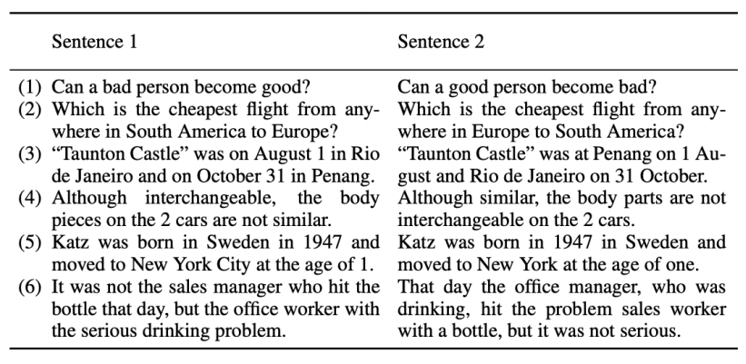
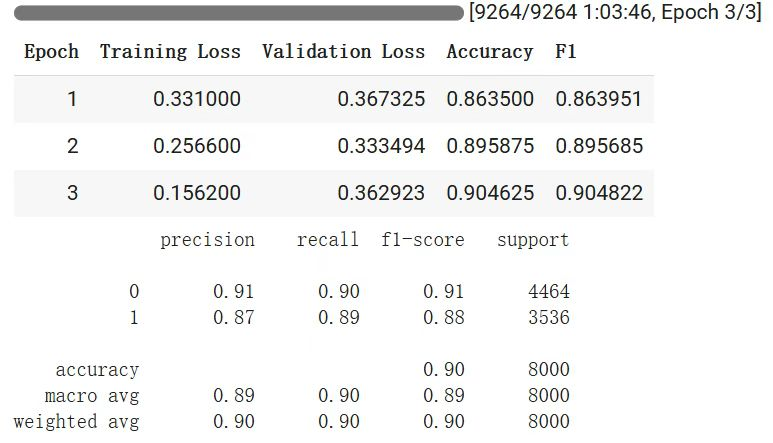

<h2 align="center">SCNU_AI1班_神经网络与深度学习课程项目_选题[No.6]</h2>

# Plagiarism Detection with Text Embedding and Similarity

## Project overview
This project is plagiarism detection based on Text Embedding and Similarity Search. Data set is chosen PAWS (https://paperswithcode.com/dataset/paws) in the project, we through the combination of traditional machine learning and deep learning model to improve existing plagiarism detection techniques. By comparing the effect of several different model combinations, the best model is finally determined for plagiarism detection task.

## Data set
The following data sets were used for model training and evaluation in this project:

PAWS (Paraphrase Adversaries from Word Scrambling) : Contains 108,463 pairs of manually annotated text, focusing on the structure and word-order information of the text.

## Model and method
We implemented and compared the following model combinations:

- CNN+SVM
- BERT+Cosine Similarity
- BERT+Random Forest
- Sentencebert+SVM
- Sentencebert+XGBoost
- Jaccard similarity +CNN
- M3E+SVM
- M3E+Trainer API
- GTE+SVM

After many experiments and evaluations, an optimal model combination is selected. Then the optimal model is further optimized and improved to achieve better results.

## Experimental result
The following is a comparison of the accuracy of each model combination:

| Model Combination        | Accuracy rate |
| ------------------------ | ------------- |
| CNN+SVM                  | 0.5359        |
| BERT+Cosine Similarity   | 0.5546        |
| BERT+Random Forest       | 0.5134        |
| Sentencebert+SVM         | 0.6247        |
| Sentencebert+XGBoost     | 0.6256        |
| Jaccard similarity +CNN  | 0.6071        |
| M3E+SVM                  | 0.5856        |
| M3E+Trainer API          | 0.8916        |
| GTE+SVM                  | 0.5040        |

After many experiments and evaluations, the M3E + Trainer API proved to be the most effective model combination. After further optimization, the results are as follows:

Here are some examples of what went right and wrong：
[example.txt](https://github.com/Nana-Juliana/dlclass/blob/main/example.txt)

## Contact information
Email：sleepy202311@gmail.com

<h3 align="left">Languages and Tools:</h3>

     

